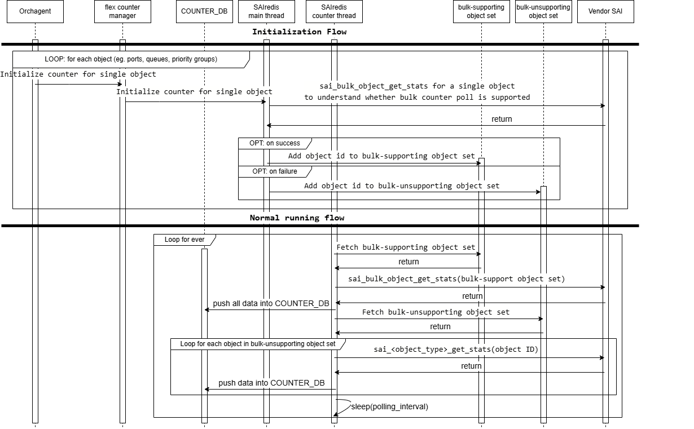
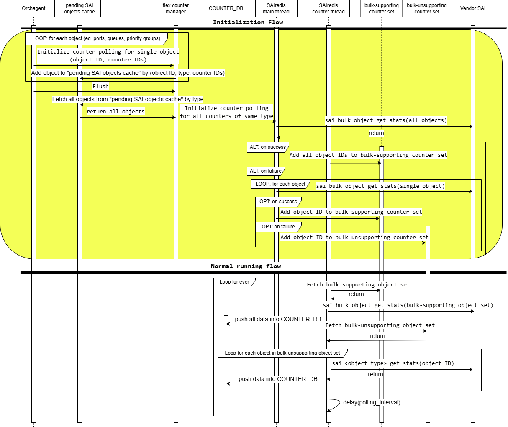

# SONiC Counter Initialization Optimization #

## Table of Content

### Revision

 | Rev |     Date    |       Author       | Change Description                |
 |:---:|:-----------:|:------------------:|-----------------------------------|
 | 0.1 |             |      Stephen Sun   | Initial version                   |

### Scope

This document is the design document for optimizing counter initialization SONiC.

Runtime counter performance optimization is out of scope.

### Definitions/Abbreviations

| Name | Meaning |
|:----:|:-------:|
| PG | Represents priority group, which is the ingress queue on a port |
| single counter-poll API | Represents the SAI API calls to fetch many counters of a single SAI object. |
|| They have the name convention of `get_<object_type>_stats` or `get_<object_type>_stats_ext`. |
|| Like `get_port_stat`, `get_port_stat_ext`, `get_queue_stat_ext`, etc. |
| bulk counter-poll API | Represents `sai_bulk_object_get_stats`, the SAI API call to fetch a uniform set of counters of many SAI objects in one-shot. |
| counter group | The way that counters are managed in SONiC. The counters are divided into different groups by their motivation. |
| flex counter | The component that manages counter polling in SONiC. |
| sub orchagents | Represents different components in `sonic-swss/orchagent` folder. Each of them handles certain tables, like portsorch, bufferorch, etc. |

### Overview

Counter is an important way to monitor a system's performance and trouble shoting. Flex Counter is responsible for managing counters in SONiC. The counters are polled, represented on a per group basis. The groups are organized based on the counters' motivation and providers. In SONiC, counters are divided into counter groups. The number of groups varies among different system. The following groups exist on all systems:

1. Port counter group
2. Port drop counter group
3. PG drop counter group
4. Queue statistics counter group
5. Watermark counter group for buffer pools, PGs and queues
6. Router interface counter group

The flex counter handles counter on a per group basis in the following ways:

- To initialize counters during system initialization
- To polls counter periodically during system running

Originally, the counters were polled using single counter-poll API, which means only one object's counters could be polled by a SAI API call. However, it is time consuming to poll the counters because there are a large number of counters on the SONiC system, which introduces performance issues.

The bulk counter poll API has been introduced to improve the performance of counter polling, enabling a set of objects' counter to be polled in one SAI API call. However, all the objects' counters do not support to be polled in bulk mode. Eg. bulk counter polling can be supported on unicast queues but not multicast queues on some platforms. It requires to check whether bulk API is supported on each object during initialization and group all the bulk-counter-supporting objects together and then poll their counters in bulk mode. We still use single counter-poll API on the objects whose counters can not be polled in bulk mode.

However, it is time-consuming to check whether bulk API is supported on each object during initialization, especially on the systems with a large number of ports. This is because:

1. The number of objects increases significantly when the number of ports increases.

    Many counters are attached on port, queue, PG objects which are the directly proportional to the number of ports.

    By default, there are 3 PGs and 8 queues per port. So, for each port there are 12 objects relevant

    There can be several counter groups attached to each object.

2. Flex counter needs to check whether bulk operation is supported by calling SAI bulk counter polling API on a per object per counter group basis.

In this design, we improve the counter initialization by checking whether bulk operation is supported on a group of objects altogether. By doing so, the number of SAI API calls is significantly reduced and the time is shorten.

#### Challenge

The counter initialization flow starts from orchagent on a per object basis. We need to group bulk-counter-polling-supporting objects together from orchagent.

#### Benefit

According to a PoC we did, the overall initialization time can be reduced by at least 30% on some platforms.

### Requirements

- The change shall not introduce any user interface change.
- The change shall be based on the current SAI API definition.

### Architecture Design

The current architecture is not changed in this design.

### High-Level Design

#### Current approach

The current flow to initialize the counter is as following:

.

1. Orchagents starts to initialize counters for each object, including ports, PGs, queues, etc. For each object, orchagent notifies the counter manager and then counter manager notifies SAIRedis to start counter polling on a set of counter IDs.
2. SAIRedis needs to call `sai_bulk_object_get_stats` for each object with counter IDs as the arguments

    1. SAIRedis adds the object to `bulk-supporting object set` if the call succeeds.
    2. SAIRedis adds the object to `bulk-unsupporting object set` if the call fails.

In the normal runtime, SAIRedis

1. Calls `sai_bulk_object_get_stats` for all object in `bulk-supporting object set` once to get statistics in bulk mode
2. For each object in `bulk-unsupporting object set`, calls `sai_<object_type>_get_stats(object ID, counter IDs)` to get statistics in single mode

To summarize, SAIRedis needs to call `sai_bulk_object_get_stats` once for each object during initialization, which slows down the initialization process.

#### Optimized approach

The optimized flow to initialize the counter is as following:

.

1. Orchagents starts to initialize counters for each object, including ports, PGs, queues, etc.
2. The counter manager caches and groups objects of same type together and notifies SAIRedis to initialize counter for a set of objects.
3. SAIRedis calls `sai_bulk_object_get_stats` with the set of objects, and counter IDs as the arguments.

    1. SAIRedis adds the object to `bulk-supporting object set` if the call succeeds.
    2. SAIRedis calls `sai_bulk_object_get_stats` for each object in the set if step 3 fails, and

        1. adds the object to `bulk-supporting object set` if step 3.2 succeeds
        2. adds the object to `bulk-unsupporting object set` if step 3.2 fails

In the optimized flow, the number of SAIRedis calling `sai_bulk_object_get_stats` is significantly reduced because it does not need to call `sai_bulk_object_get_stats` once for each object but just once for many objects, which accelerates the initialization process.

#### Detailed change

##### sonic-swss

###### Flex counter manager

The Flex counter manager is a class introduced to manage a flex counter group. It is defined in file https://github.com/sonic-net/sonic-swss/blob/master/orchagent/flex_counter/flex_counter_manager.cpp

The sub orchagents use flex counter manager to

- enable/disable counter polling
- set counter polling interval
- add/remove an object to/from the counter group

Originally, when a sub orchagent called flex counter manager to add an object to the counter group, flex counter manager directly notified SAIRedis to start to poll counters on the object.

In this design, batch mode is introduced to enable the flex counter manager to notify SAIRedis to start to poll counters on a set of ojbects altogher.

1. A flag is introduced as an argument of the constructor to indicate whether the batch mode is enabled.
2. A cache, `pending_sai_objects`, is introduced, which accommondates all objects that have been notified by sub orchagent but have not notified SAIRedis to start to poll counters.
3. A method `flush` which notifies SAIRedis to start to poll counters on all the object in `pending_sai_object`
4. The sub orchagent should call `flush` explicitly.

###### Ports orchagent

Ports orchagent manages counter polling of port, PG, and queue relevant flex counter groups.

1. Call method `flush` of flex counter manager directly in method `doTask` of ports orchagent.

    method `doTask` is essentially the `main loop` of each sub orchagent. It handles all `CONFIG_DB` or `APPL_DB` table updates.
2. Originally, there was a single flex counter manager object managing a flex counter group for all queue objects. In this design we will introduce two flex counter manager objects for each queue relevant flex counter group, for unicast and multicast qwueues respectively.
3. Originally, the PG flex counter group is not managed using flex counter manager. In this design, we will manage PG flex counter group using flex counter manager to simplify the code.

##### sonic-sairedis

Support starting counter polling on a set of objects.

### SAI API

N/A

### Configuration and management

N/A

### Warmboot and Fastboot Design Impact

N/A

### Restrictions/Limitations

N/A

### Testing Requirements/Design

#### Unit Test cases

TBD
