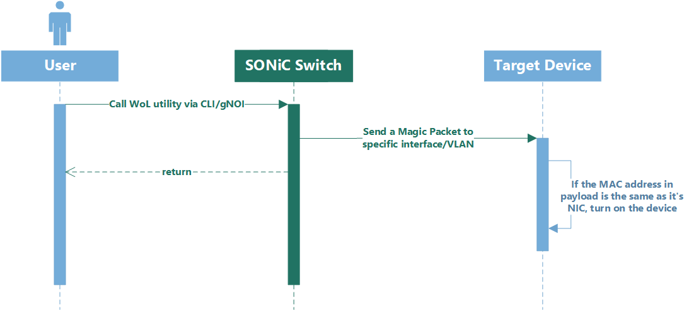

# Wake-on-LAN in SONiC

## Table of Content

- [Overview](#overview)
- [Background](#background)
- [Magic Packet](#magic-packet)
- [CLI Design](#cli-design)
- [gNOI Design](#gnoi-design)
- [Test Plan](#test-plan)
- [Reference](#reference)

## Revision

| Revision | Date        | Author           | Change Description |
| -------- | ----------- | ---------------- | ------------------ |
| 1.0      | Oct 24 2023 | Zhijian Li       | Initial proposal   |

## Definitions/Abbreviations 

| Abbreviation | Definition                                        |
|--------------|---------------------------------------------------|
| WoL          | **W**ake-**o**n-**L**AN                           |
| gNOI         | **g**RPC **N**etwork **O**perations **I**nterface |
| NIC          | **N**etwork **I**nterface **C**ontroller          |

## Overview

**Wake-on-LAN** (**WoL** or **WOL**) is an Ethernet or Token Ring computer networking standard that allows a computer to be turned on or awakened from sleep mode by a network message[^1]. This document describes the Wake-on-LAN feature design in SONiC.

## Background

Below diagram describes a common usage of WoL on SONiC switch, this HLD will focus on the green part:



## Magic Packet

**Magic Packet** is a Ethernet frame with structure:

* **Ethernet Frame Header**:
  * **Destination MAC address**: broadcast MAC address (ff:ff:ff:ff:ff:ff) or target device's MAC address. [6 bytes]
  * **Source MAC address**. [6 bytes]
  * **EtherType**: `0x0842`. [2 bytes]
* **Ethernet Frame Payload**:
  * Six bytes of all 0xff. [6 bytes]
  * Sixteen repetitions of the target device's MAC address. [96 bytes]
  * (Optional) A four or six byte password. [4 or 6 bytes]

```
Byte     |
Offset   |0     |1     |2     |3     |4     |5     |
---------+------+------+------+------+------+------+
       0 |             Destination MAC             |
         +------+------+------+------+------+------+        ETHERNET FRAME
       6 |               Source MAC                |           HEADER
         +------+------+---------------------------+
      12 | 0x08 | 0x42 |   \      \      \      \
         +------+------+------+------+------+------+------------------------------
      14 | 0xFF | 0xFF | 0xFF | 0xFF | 0xFF | 0xFF |
         +------+------+------+------+------+------+        ETHERNET FRAME
      20 | Target MAC (repeat 16 times, 96 bytes)  |           PAYLOAD
         +-----------------------------------------+
     116 |    Password (optional, 4 or 6 bytes)    |
         +-----------------------------------------+
```

## CLI Design

The `wol` command is used to send magic packet to target device.

This command requires root privilege because it'll modify the power-mode of target device.

### Usage

```
wol <interface> <target_mac> [-b] [-p password]
```

- `interface`: SONiC interface name.
- `target_mac`: MAC address of the target device.
- `-b`: Use broadcast MAC address instead of target device's MAC address as **Destination MAC Address in Ethernet Frame Header**.
- `password`: An optional 4 or 6 byte password, in ethernet hex format or quad-dotted decimal[^3].

### Example

```
admin@sonic:~$ wol Ethernet10 2c:dd:e9:fc:df:08
admin@sonic:~$ wol Ethernet10 2c:dd:e9:fc:df:08 -b
admin@sonic:~$ wol Vlan1000 2c:dd:e9:fc:df:08 -p 00:22:44:66:88:aa
admin@sonic:~$ wol Vlan1000 2c:dd:e9:fc:df:08 -p 192.168.1.1
```

## gNOI Design

The gNOI service `SONiCWolService` will provide a `Wol` interface to user, which can be called to send magic packet to target device:

```proto
syntax = "proto3";

package gnoi.sonic_wol;

//option (types.gnoi_version) = "0.1.0";
import "github.com/gogo/protobuf/gogoproto/gogo.proto";

option (gogoproto.marshaler_all) = true;
option (gogoproto.unmarshaler_all) = true;

service SonicWolService {
  rpc Wol(WolRequest) returns (WolResponse) {}
}

message WolRequest {
    string interface = 1;  // SONiC interface name
    string target_mac = 2; // MAC addresses in colon notation
    optional bool broadcast = 3;  // Default false
    optional string password = 4; // In ethernet hex format or quad-dotted decimal
}

message WolResponse {
    SonicOutput output = 1;
}
```

## Test Plan
Test plan will be published in [sonic-net/sonic-mgmt](https://github.com/sonic-net/sonic-mgmt).

## Reference

[^1]: [Wake-on-LAN - Wikipedia](https://en.wikipedia.org/wiki/Wake-on-LAN)
[^2]: [ether-wake.c - BusyBox](https://git.busybox.net/busybox/tree/networking/ether-wake.c)
[^3]: [Dot-decimal notation - Wikipedia](https://en.wikipedia.org/wiki/Dot-decimal_notation)
